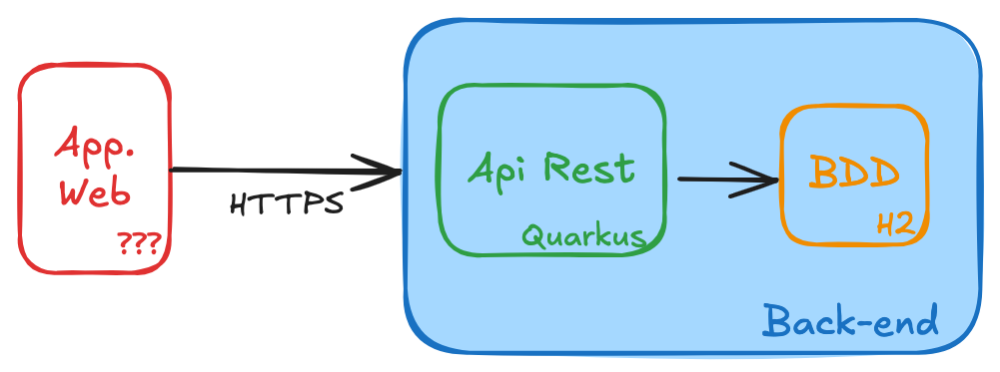

# Rappels

## Sujet : Faire Burger Quizz !
Vous avez 4 séances de TD/TP pour  produire un site web qui permettent de répondre à des questions et  donne le score.

## Environnement
L'ensemble des  4 TD/TP sont à réaliser sur **_Gitpod_**.
Vous devez réutiliser le compte que vous avez crée durant la première séance.

## Déroulement

Comme au premier TP, vous devez suivre le même processus que pour contribuer à projet:
1. Dupliquer (**Forker**) le projet github
1. Modifier / compléter des fichier du repo. forké
1. Commiter vos modifs sur votre repo.
1. Proposer vos modifications sur le repo. parent (**PullRequest**)

## Architecture
L'architecture   générale de  l'application  Burger Quizz est la suivante :

Une application web consomme une API Rest Quarkus  qui s'appuie sur une base de données relationnelles en  mémoire **H2**.

## TP2 - Implementation Back-End

La stack technique a été choisie durant le TD/TP1 : Quarkus.

Votre client  veut une api de quizz en français qui :
* Liste des questions
* Liste des propositions d'une question
* Evalue les réponses

**L'objectif de ce second TP est de produire une API Rest Quarkus qui réponde à ce besoin tout en appliquant un maximum de bonnes pratiques d'éco-conception.**
Vous partez d'un socle existant qu'il faut améliorer.

# Fork du projet
L'objectif est de créer une copie du projet 'miage-numres-step1' sur votre compte github.

1. Se rendre sur le projet github [miage-numres-step1] (https://github.com/aepsilon-tek/miage-numres-step1)
1. Fork du projet grâce au bouton

# Evaluer l'existant